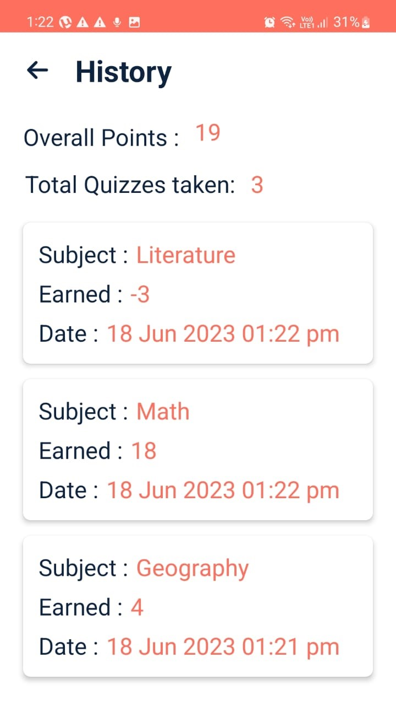

## Quiz App
### A Quiz Android application 📱 built using Java ♨️
## Scan QR Code
  

### Get Apk [Download here](https://raw.githubusercontent.com/pikachu404/Quiz-App/master/app/release/app-release.apk)
------------
## ⚙️ Features
* App consists of Quiz of primarily three subject - Maths, Geography, Literature
* Maintaining history of previous attempts of quiz using Room.
* You can switch users using the Login/Register
* Feature to change to your current password
* Added loader while data is being fetched from API
* Showing the result at the end the Quiz.
* Implemented login, register,edit password, previous attempts all using SQL Lite DB using Room 

## 🚀 Technology Used

* Quiz App is build using Java
* Asynctask for asynchronous
* Room Persistence Library

## 📸 Screenshots


   

## ⚡ Dependencies Used
```sh
* Room Persistence Library 2.2.5
* Gson 2.8.6
```
